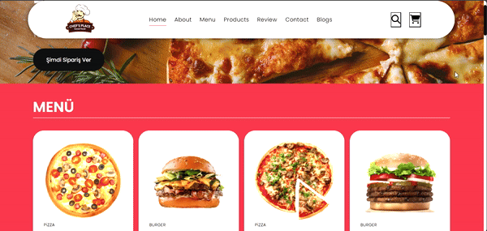

## Restaurant Menu Website

This project is a single-page restaurant menu website that showcases a variety of dishes and allows users to interact with the menu. The site includes sections for dish reviews, pricing information, and order placement.

### Technologies Used
 - HTML5: Provides the structural layout and content organization for the website.
 - CSS3: Styles the site visually and creates a visually appealing and responsive design.
 - JavaScript: Adds interactivity to the site, manages dynamic content updates, and handles order placement.
 - 
### Interactive Menu
 - Users can browse various dishes and view detailed information including prices and reviews.
 

## Restoran Menü Web Sitesi

Bu proje, çeşitli yemekleri sergileyen ve kullanıcıların menü ile etkileşime geçebileceği tek sayfalık bir restoran menüsü web sitesidir. Site, yemek yorumları, fiyat bilgileri ve sipariş oluşturma gibi bölümleri içermektedir.

### Kullanılan Teknolojiler
 - HTML5: Web sitesinin yapısal düzenini ve içerik organizasyonunu sağlar.
 - CSS3: Siteyi görsel olarak stilize eder ve tasarımı ile ilgili detayları oluşturur, çekici ve uyumlu bir düzen sağlar.
 - JavaScript: Siteye etkileşim katar, dinamik içerik güncellemeleri ve sipariş oluşturma işlemlerini yönetir.

### Etkileşimli Menü
 - Kullanıcılar, çeşitli yemekleri inceleyebilir ve fiyatlar ile yorumlar dahil detaylı bilgileri görüntüleyebilir.

### Proje Tanıtımı (Project Demo) (GIF) 

Aşağıda, restoran menüsü web sitesinin işlevselliğini gösteren kısa bir tanıtım GIF'i bulunmaktadır:  

 

https://betulaktoprak.github.io/food_website/
